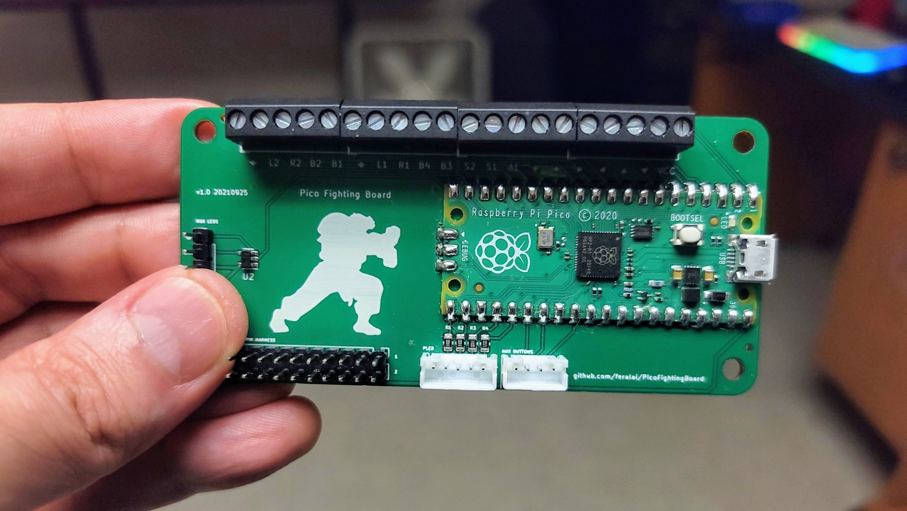

# Pico Fighting Board

Open source PCB for arcade sticks using Raspberry Pi Pico.

## Introduction

They say imitation is the highest form of flattery. If that's the case then the Brook line of arcade controller boards must be blushing beet red. The Pico Fighting Board uses the same form factor and layout of the Brook PCBs to maintain compatibility with existing arcade stick cases, wiring harnesses, wire management accessories, etc.

The files for PCB production are in the [Releases](https://github.com/FeralAI/PicoFightingBoard/releases) section. The zip file contains the Gerber and drill files, which is all you'll if you're soldering SMT components yourself. There are also `csv` files for the BOM (Bill of Materials) and component positioning for SMT assembly service.

I will also have premade boards periodically available for purchase at <https://shop.feralai.com/product/pico-fighting-board>.

## Firmware

The [GP2040](https://github.com/FeralAI/GP2040) gamepad firmware for Pi Pico/RP2040 has a pre-configured build for use with the Pico Fighting Board, providing support for XInput (PC, Android, Raspberry Pi, etc.), DInput (PC/PS3) and Nintendo Switch. [Go to the releases](https://github.com/FeralAI/GP2040/releases) and download the `GP2040-PicoFightingBoard.uf2`. To flash:

1. Unplug your Pico Fighting Board.
1. Hold the BOOTSEL button on the Pico and plug into your computer. A new removable drive named `RPI-RP2` should appear in your file explorer.
1. Drag and drop the `GP2040-PicoFightingBoard.uf2` file into the removable drive. This will flash the board.
1. The board should now be running the GP2040 firmware and should appear as a controller on your computer.

## Modification

If you want to modify the PCB layout you'll need the free [KiCad software](https://www.kicad.org/download/) installed. KiCad 5.1.9 was used for these instructions.

### Libraries

The [`libraries`](https://github.com/FeralAI/PicoFightingBoard/tree/main/libraries) folder contains the schematics and footprints required to work with the KiCad source files.

#### Symbols

1. From the KiCad `Preferences` menu, select `Manage Symbol Libraries...`.
1. In the `Global Libraries` tab, click the folder icon.
1. Navigate to this repository, then navigate to `libraries/RP-Pico Libraries` and select the `MCU_RaspberryPi_and_Boards.lib` file.
1. Click `OK` to finish.

#### Footprints

1. From the KiCad `Preferences` menu, select `Manage Footprint Libraries...`.
1. In the `Global Libraries` tab, click the folder icon.
1. In the `Select Libary` dialog, navigate to `libraries/RP-Pico Libraries/MCU_RaspberryPi_and_Boards.pretty` in this repository.
1. Click `OK` to confirm the folder selection.
1. Repeat the same process for the `libraries/FeralAI/FeralAI.pretty` folder.
1. Click `OK` to finish.
